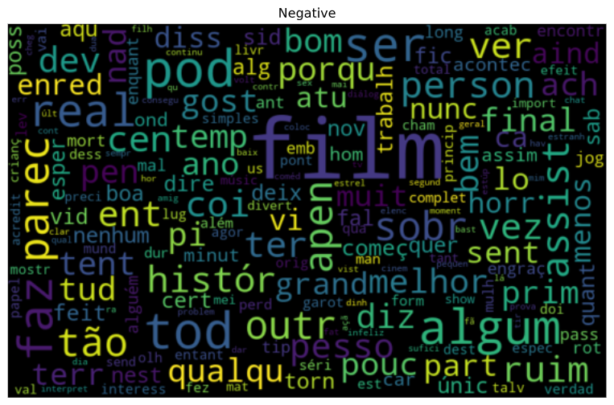
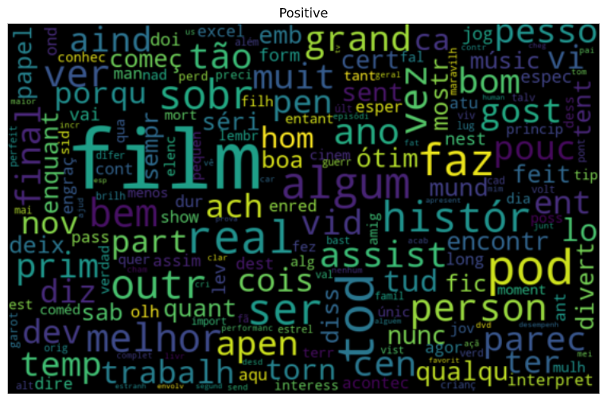

# :rocket: natural_language_processing

                                           # Natural Language Processing
                                            Technologies   |    Project   

## :pushpin: Technologies

The following technologies were used:

💻 python

💻 seaborn

💻 wordcloud

💻 sklearn

💻 pandas

💻 nltk

## :point_right: Project

 project focused on the development of a text sentiment analyzer using natural language processing with python, to differentiate between positive and negative reviews of imdb.
 
 
 ## :pushpin: Tips
 
 
 This project was developed in VScode, if you use the same IDE, run the program in Python Interactive Window to view the graphics.
 the data for imdb-reviews-pt-br.csv was downloaded from kaggle.
 
 
  ## :pushpin: Examples - wordclouds
  
  
 ## Wordclouds for positive and negative reviews
 
 
 
 
